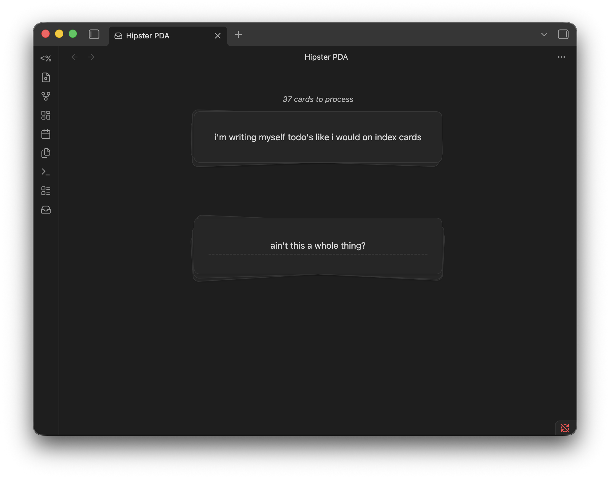

# Hipster PDA

A card-based GTD inbox plugin for [Obsidian](https://obsidian.md), inspired by the [Hipster PDA](https://en.wikipedia.org/wiki/Hipster_PDA) concept.

> **Work in progress** — this plugin is under active development and not yet ready for general use.



## What it does

- **Capture** items onto a blank notecard (brain-dump style)
- **Process** a stacked deck of cards using a step-by-step GTD decision tree
- **Triage** items into PARA destinations within your vault

## Development

```bash
npm run dev    # watch mode
npm run build  # production build
```
